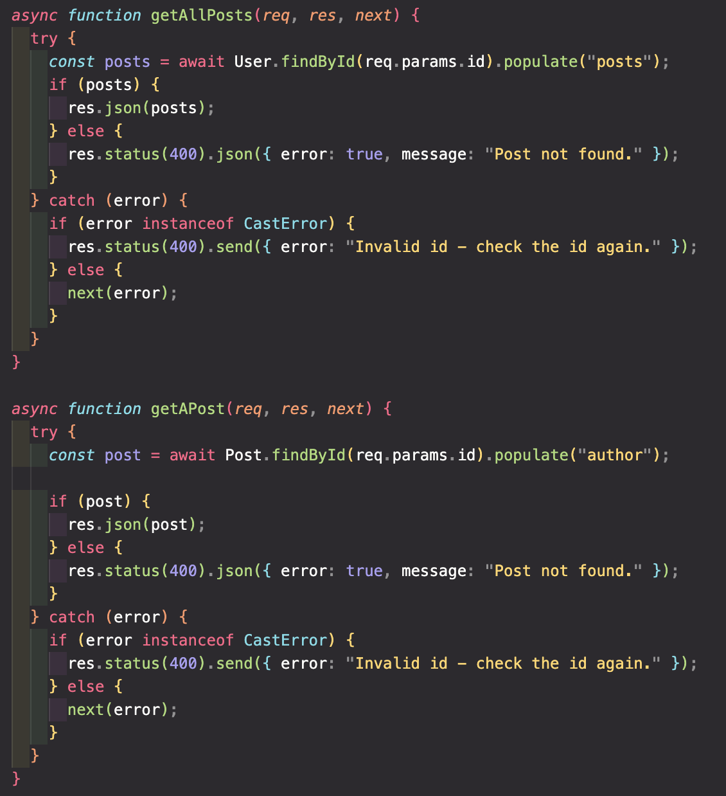

# Postcode Readme

# Description

Postcode is a platform built for coders who want to briefly share their coding learnings and journey—away from the metrics of social media and popular Software Engineering blogging platforms. I built Postcode over the course of three weeks using the MERN stack (MongoDB, Express.js, React, and Node.js).

### Technologies used

- HTML5
- CSS
- JavaScript (ES6)
- ReactJS
- Mongoose and MongoDB
- Node.js
- Express.js
- Git
- GitHub

## Deployment link

The Postcode application be accessed here: https://postcode-app.netlify.app

To use the application without having to signup, use this test user:

Email: adar@email.com

Password: pass

Please note: the website’s backend is hosted on Render’s free tier, which limits speed. Navigating and performing CRUD functionalities on the application is therefore slower. Login and registration can take up to 30 seconds to action once a form has been submitted. It’s therefore advised not to resend a fetch request by re-clicking the submit button.

## Getting Started/Code Installation

To run the project following download, enter the following commands in your terminal:

1. In the client folder run `npm install` and then `npm start`
2. In the server folder run `npm install` and then `npm start`

You will need to create a .env file with the following environment variables: DATABASE_URL, PORT, and SECRET.

## Planning

As the application would share some of the core features of a blog, I focussed on ensuring a user’s ability to create, read, update, and delete their posts and about status.

To visualise the application's components, I mapped out the user's journey across Postcode and what would be required to allow for navigations and interactions to occur with ease.

To keep myself on track, I used Todoist to break down each feature of the application into manageable tasks to focus on, and a planner to ensure I managed my time sensibly.

I utilised Dribble for layout and colour theme inspiration and designed Postcode’s CSS on Excalidraw. Below are snippets of the CSS for the homepage and the user posts page:

The infographic on the homepage and the icons across the application were sourced from [Flaticon](https://www.flaticon.com/) and [Freepik](https://www.freepik.com/).

Infographic:

- [Typing illustration](https://www.freepik.com/free-vector/code-typing-concept-illustration_10259340.htm) by[Storyset ](https://www.freepik.com/author/stories)

Icons:

- [Diagonal arrow](https://www.flaticon.com/free-icon/diagonal-arrow_2223606) by [Bqlqn](https://www.flaticon.com/authors/bqlqn)
- [Plus icon](https://www.flaticon.com/free-icon/plus_3312174) by [Hajicon](https://www.flaticon.com/authors/hajicon)
- [Pen icon](https://www.flaticon.com/free-icon/pen_1250615) by[Icongeek26](https://www.flaticon.com/authors/icongeek26)
- [Trash icon](https://www.flaticon.com/free-icon/trash_3177276) by [Kmg design](https://www.flaticon.com/authors/kmg-design)

## Build/Code Process

### Server: Models, Controllers, and Routes

After getting the application’s files set up, I created models for users and posts that reference each other and include validation.

Next, I created two controller files, one for users and one for posts. The users controller includes functions for handling user login, registration and user about status updation.

The post controller actions the creation, reading, updation, and deletion of a post.

As you can see above, the error messages for the controllers were customised where necessary, and where not: an errorHandling middleware sends the following generic error:

For the user and post routes, I ensured that only authenticated users were able to modify posts and created a checkAuth middleware to verify this. Below is the post routes.

With the server side now prepped, it was time to move on to the client side. There, a utilities folder houses the fetch requests to the server.

### Client: User about and all posts

Once a user has logged in or registered, they’re navigated to the posts route. In the top section are the user’s name and about status. Users can edit their about status by clicking on the edit icon, which navigates to a separate page. Below is the form portion of the edit component’s code:

Below the user's about status is a list of their posts ordered by the most recent. To create a post, a user must click on the “Add” text or icon, which will navigate them to another component that actions this. Below shows what a user's posts page will look like after they’ve updated their status and created two posts:

Displaying these posts and the user about status in this posts route is a single GET request that will query the user database and populate a user's posts. The call for this is in the postService file in the utilities folder:

### Client: Detail, edit, and delete pages

To view a post, a user clicks on the title or “Read more” link of a post on the posts route. This component also enables users to delete a post. The code for displaying the post is a simple GET request that queries the posts database using the post’s ID. When clicked, the delete button will fire a DELETE request using the post’s ID.

Below is what the detail page looks like for the earlier created post:

Clicking on the edit icon will navigate the user to the edit page. Within this component, I dynamically collect the data input and implement form validation. See below for code snippets:

See below for the visualised process of editing a post and seeing its changes on the posts route:

### Challenges

The most fiddly part of this project was the delete post functionality., strangely. Despite being able to delete the post, I had some trouble figuring out how to asynchronously delete the post from the user’s record. What tremendously helped was to take a step back and look beyond the Mongoose and MongoDB commands and look at the code for what it really is, an object with a nested array. Stripping back the code to its basics thus enabled me to formulate a solution.

### Wins

I’m proud to have developed a full-stack application in the MERN stack without assistance and to have had the process be relatively smooth.

This project further solidified my comfort and enjoyment in frontend development.

### Key Learnings/Takeaways

This project enabled me to strengthen my debugging process and explore my curiosities with code styles and inputs without the constraint of time. Consequently, I feel much more confident heading out into unfamiliar territories.

### Bugs

If a logged-in user does a hard refresh on any page other than the main homepage, a “Page Not Found” is returned instead of the page they’re on. I’m still troubleshooting this issue.

### Future Improvements

Future improvements to Postcode will include pagination and search functionality.
